# clinical_final_project
<!--Headline-->
<!--Image-->
<!--UL-->
<!-- URLs-->
# Team number: 15
# Team Members:&nbsp;&nbsp;Sec:&nbsp;&nbsp;&nbsp;ID:     
## Ahmed Adel Ahmed&nbsp;&nbsp;&nbsp;&nbsp;Sec:1&nbsp;&nbsp;&nbsp;ID:6  
## Ahmed El-nouby&nbsp;&nbsp;&nbsp;&nbsp;&nbsp;&nbsp;&nbsp;&nbsp;&nbsp;Sec:1&nbsp;&nbsp;&nbsp;ID:3 
## Donia Abd El-salam&nbsp;&nbsp;&nbsp;&nbsp;&nbsp;Sec:1&nbsp;&nbsp;&nbsp;ID:29   
## Gehad Mohamed&nbsp;&nbsp;&nbsp;&nbsp;&nbsp;&nbsp;&nbsp;&nbsp;&nbsp;Sec:1&nbsp;&nbsp;&nbsp;ID:27    
## Nancy Salah&nbsp;&nbsp;&nbsp;&nbsp;&nbsp;&nbsp;&nbsp;&nbsp;&nbsp;&nbsp;&nbsp;&nbsp;&nbsp;&nbsp;&nbsp;&nbsp;&nbsp;Sec:2&nbsp;&nbsp;&nbsp;ID:37    
# Our application results:
### Tables of data:
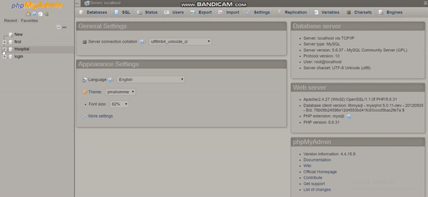
### Representing first equipments for each department with applicability of more than one report to be selected to be retrieved or made for each equipment in any department
* All reports are applicable for all equipments in any department to be made or retrieved.
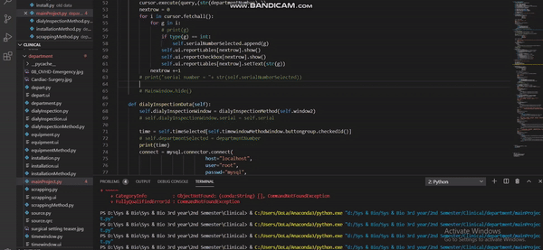
### Series steps that you can follow to add a new equipment in any department
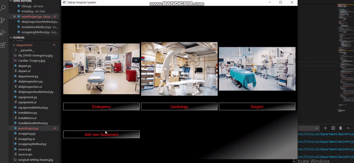
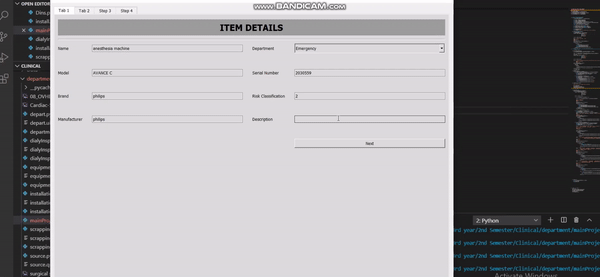
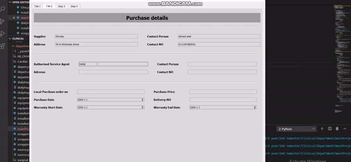
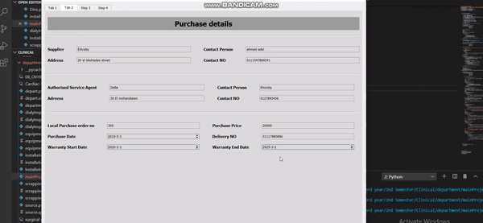
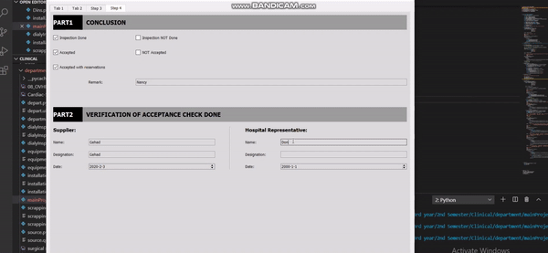
### Installation Report 
* In emergency departement.

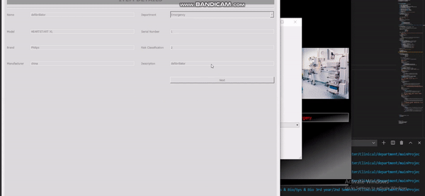
### Daily Inspection Report 
* In emergency departement.

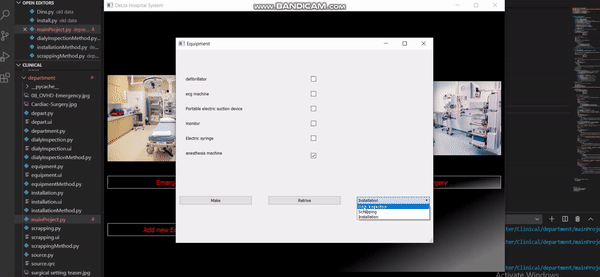
### Scrapping Report:
* In Cardiology department it also exist for emergency and surgery departement.  

##  Here represinting installation report for equipment from cardiology department
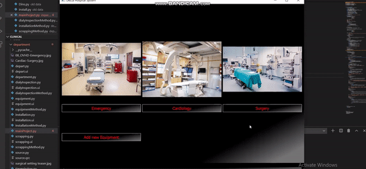
##  Here represinting all reports for any equipment from surgery department
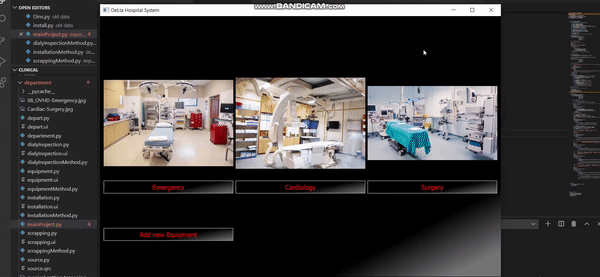
## Our Tables of data after adding new equipment through our application 
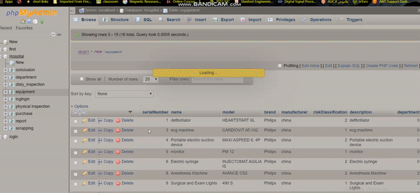
# Our video
<!-- blank line -->
<figure>
  <video controls="true" allowfullscreen="true">
    <source src="video.mp4" type="video/mp4">
  </video>
</figure>
<!-- blank line -->